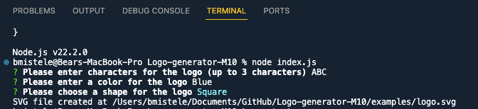

# Logo-Generator-M10
## Table of Contents
* [Description](#description)
* [Usage](#usage)
* [License](#license)
* [Tests](#tests)
    

## Description

The program allows the user to input a 3 character text, a color, and a shape. For the shape, the user can pick between a triangle, circle, and square.

An SVG file based on the user's input is then generated in the "examples" folder.

## Usage
To run the program, navigate to the SVG-Logo-Generator folder and enter "node index.js" into your local terminal. Follow the steps as prompted.

Once all the prompts have been answered, a message will be displayed stating the SVG file has been generated. It will also display the pathway to the subdirectory "examples" where your program was generated.

[Please see this video demo.](https://drive.google.com/file/d/1mHmUWHEdJ1jYjVXDOQl4cDH_aVDZi3eM/view?usp=drive_link)

## License
This project is licensed under the MIT License. For more information, please see the [MIT License](https://opensource.org/licenses/MIT).

## Credits
This program was created by Barrett Mistele

